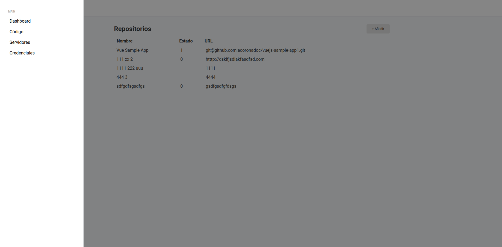
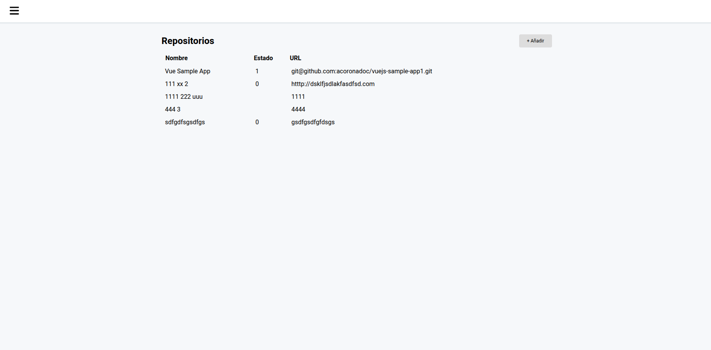
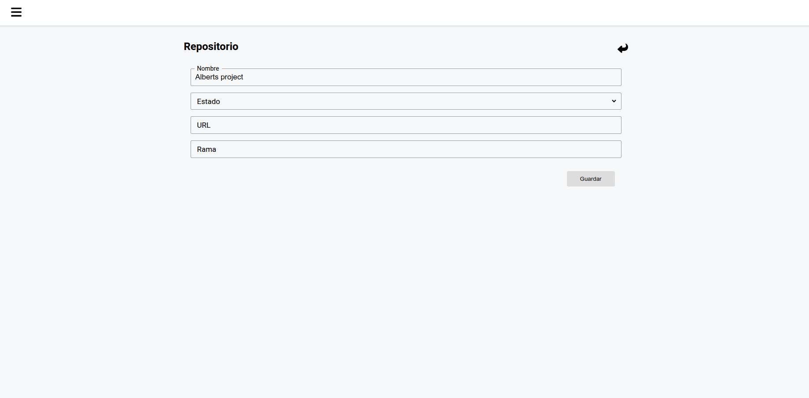
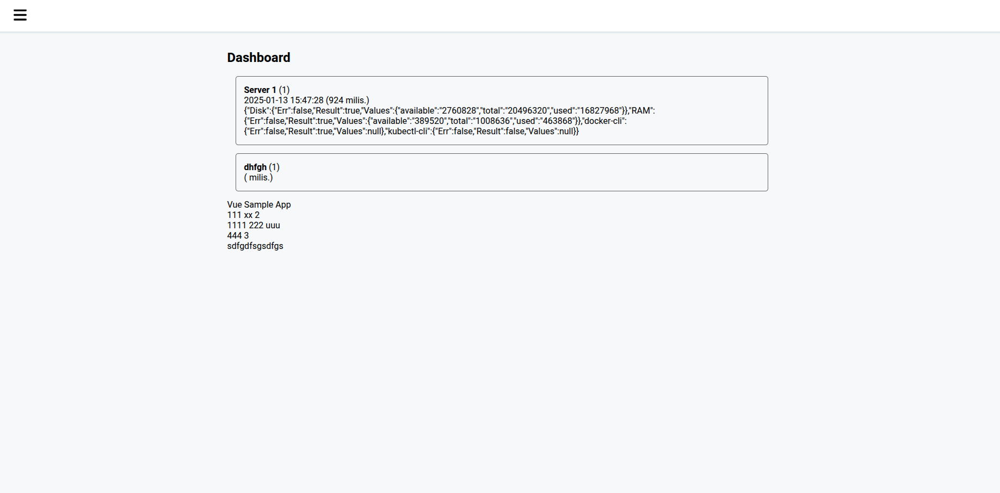

A project under development(still in incubation) for fast developing of MVPs(Minimum Viable Products), corporate apps or PoCs(Proof Of Concepts) among others using your own tech stack and make easy scalability, high availability, resource-efficient, cost-effective solutions as well as Green Coding.

## When to choose(still in incubation)

- Requirement to develop corporate software, PoCs, MVPs.
- Reduce development time and effort and adopt a flexible and scalable approach.
- Extend as you wish. Even using your own stack: Golang, Java, Python, etc.
- Low resource consumption and low operational costs.
- Green Code.

## 🚀 Quick start

An example application implemented with the framework is available in the 'garagedevops' folder:

1. First step, you need a MySql database with this tables:

```
CREATE TABLE `DataObjects` (
  `id` varchar(100) NOT NULL,
  `perms` longtext NOT NULL DEFAULT '{}',
  `reg` longtext NOT NULL DEFAULT '{}',
  `metadata` longtext NOT NULL DEFAULT '{}',
  `owners` longtext NOT NULL DEFAULT '{}',
  `objecttype` varchar(100) NOT NULL
) ENGINE=InnoDB DEFAULT CHARSET=utf8mb4 COLLATE=utf8mb4_uca1400_ai_ci;
```

2. Configure file 'config.yml'.
3. Start the application by:

```
go run main.go
```

## 📸 Screenshots










